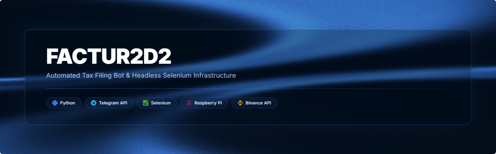
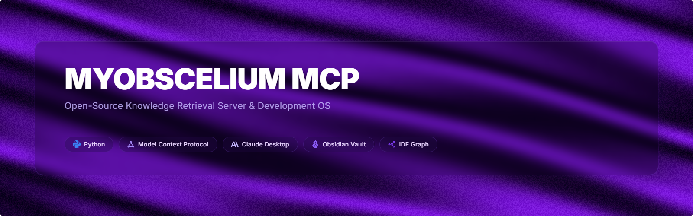

<h1 align="center">Matheo Guevara</h1>

Python developer. I design systems, solutions, and architecture, then direct AI pipelines to build and ship them, with maximum velocity.

  <a href="https://matheo.guevara.ar/">Portfolio</a> ·
  <a href="https://www.linkedin.com/in/matheoguevara/">LinkedIn</a> ·
  <a href="mailto:teh.dsc@gmail.com">Email</a>

---

### Projects

Full-stack course platform for a private client. Mobile-first, video delivery with access controls, dual regional payment gateways. Shipped MVP solo in under a month by directing a staged verification pipeline across 100+ tasks. Repo's private, but there's a full write-up on my [portfolio](https://matheo.guevara.ar/).

 

Telegram bot that automates official tax-invoice filing, running 24/7 on a Raspberry Pi. In production since 2025, reverse-engineered the government portal after the official API proved unreliable.

 

AI research assistant grounded in 249K+ transcript chunks from 91 curated YouTube channels. Hybrid semantic and keyword retrieval, every answer cited to an exact timestamp.

 

MCP server connecting Claude Desktop to an Obsidian vault. 19 tools for note I/O, IDF-based relinking, and tiered context retrieval. Full read and write access turns it into something close to unlimited context, nothing on a months-long build gets forgotten or goes stale. How I actually use it is a longer story, more on my [portfolio](https://matheo.guevara.ar/).

 

**[pi-sentinel](https://github.com/ktehllama/pi-sentinel)**, a lightweight daemon that watches a Raspberry Pi's CPU, RAM, disk, and network, and alerts over Telegram when something breaks. `Go`

---

### Stack

Currently learning:  
